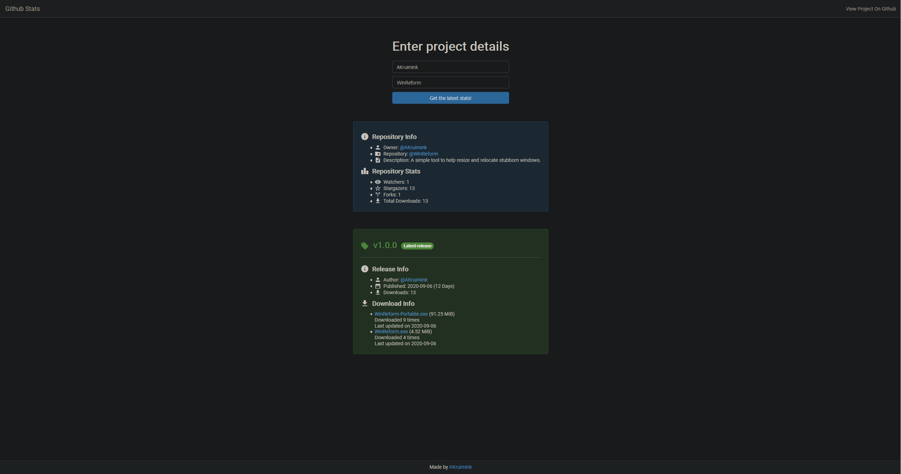

<!-- Markdown doesnt like aligning stuff -->

    
    <h1> <a href="https://akruimink.github.io/GithubStats/" target="_blank">Github Stats</a></h1>
    

        A simple site that makes it easy to quickly observe the stats of any Github repository.
    

## About
Github Stats is a utility site that exists to solve the lack of information Github sometimes provides, especially around release data.
Often times when a user releases a new application or version they are excited to see how well it's doing, only to find out that Github does not provide any real or meaningfull way of seeing data about it.
This often leads to a path of navigating the Github Api to find some more information, which is a combersome job.

But not any longer, Github Stats is here to simplify this.
Want to see when and by whom a release was published? Github Stats!
Want to see the amount of downloads a release received? Github Stats!
Maybe interested in the total download count, the amount of watchers, stargazers or forks? Github Stats!
Anything you might want to know about a project in a simple and concisely form factor by Github Stats!

## License
Github Stats is provided as-is under the Apache License Version 2.0. For more information see [LICENSE](./LICENSE.md).

## ShowRoom
